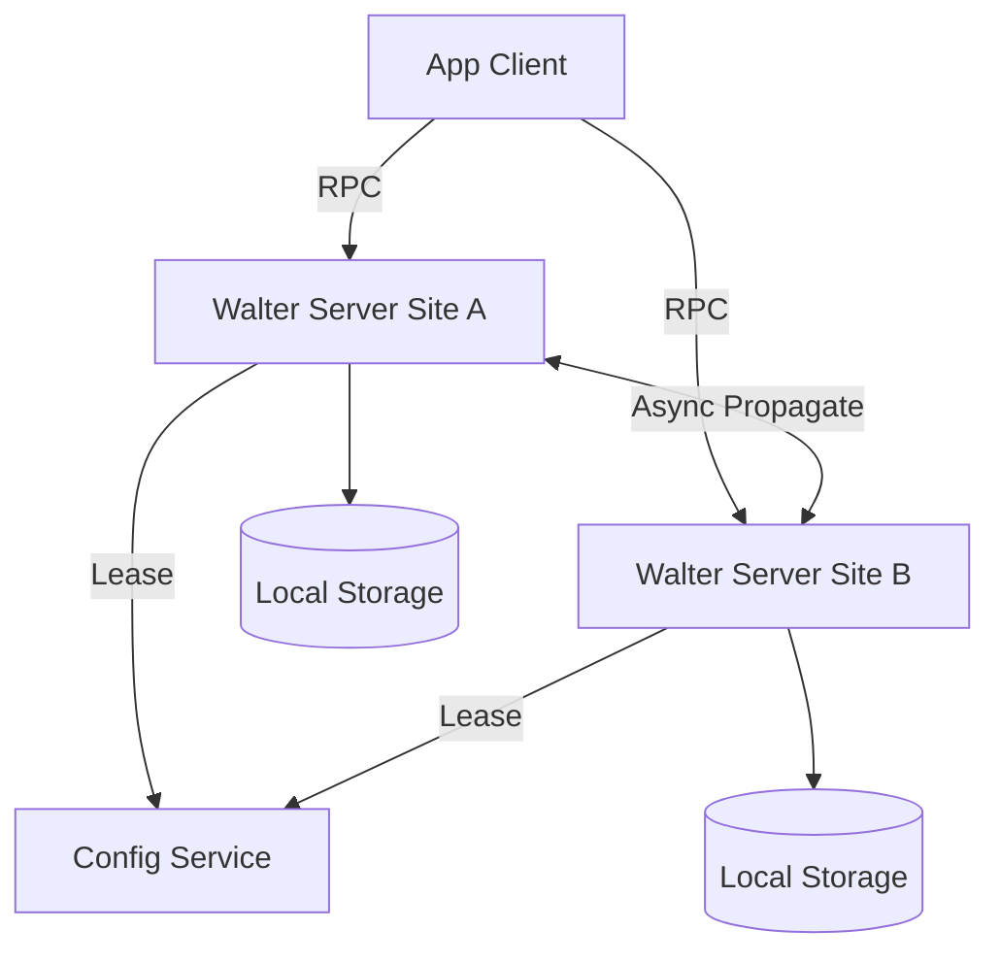

# Walter-Python: 地理分布式事务键值存储系统实现指南

## 1. 系统概述

**Walter** 是一个支持事务的地理分布式键值存储系统（Geo-replicated Key-Value Store）。它旨在为跨数据中心部署的 Web 应用（如社交网络）提供低延迟、高可用的存储后端。

### 1.1 核心特性
*   **并行快照隔离 (PSI, Parallel Snapshot Isolation)**：一种新型隔离级别。在同一站点内提供强一致性（快照隔离），跨站点仅提供因果顺序（Causal Ordering），允许异步复制以降低延迟。
*   **无冲突写入 (Conflict-Free Writes)**：通过 **首选站点 (Preferred Sites)** 和 **计数集合 (Counting Sets, csets)** 技术，绝大多数事务无需跨站点协调即可提交，避免了复杂的冲突解决逻辑。
*   **异步复制**：事务在本地提交后，后台异步传播到其他站点，显著降低写延迟。
*   **灾难安全耐久性 (Disaster-safe Durability)**：支持配置事务复制到 `f+1` 个站点后确认为安全持久化。

### 1.2 PSI 实现原理详解

Walter 的核心创新在于如何在保证数据一致性的前提下实现异步复制。以下是 PSI 在系统中的具体实现机制及关键名词解释：

#### 1.2.1 并行快照隔离 (PSI)
PSI 是传统快照隔离（Snapshot Isolation, SI）的 relax 版本，专为地理分布式系统设计。
*   **站点内强一致性**：在同一站点内，事务看到的快照是一致的，且提交顺序是固定的。
*   **跨站点因果顺序**：不同站点之间不要求全局统一的提交顺序，但必须保证**因果顺序**。例如，如果事务 B 依赖于事务 A 的结果（B 读取了 A 的写入），那么在任何站点，A 必须在 B 之前提交。
*   **无写写冲突**：PSI 保证任何两个并发提交的事务不会修改同一个对象，从而消除了冲突解决的需求。

#### 1.2.2 首选站点 (Preferred Site)
为了减少跨站点协调，Walter 为每个对象（或容器）分配一个**首选站点**。
*   **定义**：对象最常被修改的站点（例如用户登录的数据中心）。
*   **作用**：当事务在该站点修改该对象时，可以直接使用**快速提交**协议，无需询问其他站点。
*   **灵活性**：对象可以在任何站点被读取，甚至被写入（但非首选站点写入会触发慢速提交）。

#### 1.2.3 快速提交 (Fast Commit)
这是 Walter 性能优化的关键路径。
*   **触发条件**：事务修改的所有常规对象的首选站点都是当前站点，或者事务仅修改 **cset** 对象。
*   **执行流程**：
    1.  **本地冲突检查**：检查对象自事务开始以来是否在本地被修改过。
    2.  **分配序列号**：本地分配一个单调递增的序列号。
    3.  **更新历史**：将写入应用到本地对象历史（History）。
    4.  **异步传播**：提交后立即返回成功，后台线程负责将更新传播到其他站点。
*   **优势**：无跨站点 RPC 延迟，提交速度极快（通常 < 30ms）。

#### 1.2.4 慢速提交 (Slow Commit)
当事务涉及跨站点写入时使用。
*   **触发条件**：事务修改的常规对象中，至少有一个对象的首选站点是远程站点。
*   **执行流程**：
    1.  **协调者角色**：当前站点作为协调者。
    2.  **两阶段提交 (2PC)**：向所有涉及对象的首选站点发送 `Prepare` 请求。
    3.  **投票与锁定**：远程站点检查冲突并锁定对象。如果所有站点投票 `YES`，则提交；否则 abort。
    4.  **提交与释放**：提交后释放锁，并异步传播。
*   **代价**：涉及跨站点网络往返，延迟较高（取决于最远首选站点的 RTT）。

#### 1.2.5 计数集合 (Counting Sets, Csets)
一种特殊的数据类型，用于彻底消除特定场景下的冲突。
*   **结构**：类似集合，但每个元素有一个整数计数（count）。
*   **操作**：`add(x)` 使 count+1，`del(x)` 使 count-1。
*   **特性**：加减法是可交换的（Commutative）。无论操作顺序如何，最终结果一致。
*   **优势**：对 cset 的修改**永远不会产生写写冲突**，因此即使跨站点修改 cset，也可以使用**快速提交**，无需协调。常用于好友列表、消息墙等场景。

#### 1.2.6 异步传播 (Asynchronous Propagation)
事务提交后的数据同步机制。
*   **机制**：提交站点后台批量发送更新到其他站点。
*   **因果顺序保证**：接收站点在应用更新前，必须确保该事务依赖的所有因果前驱事务（根据 **向量时间戳 VTS** 判断）已经到达并提交。
*   **耐久性级别**：
    *   **本地耐久**：本地日志落盘。
    *   **灾难安全耐久**：更新已复制到 `f+1` 个站点。
    *   **全局可见**：更新已提交到所有站点。

#### 1.2.7 向量时间戳 (Vector Timestamps, VTS)
用于替代全局时钟，跟踪因果依赖和快照版本。
*   **结构**：一个向量，每个元素代表一个站点的最新提交序列号。例如 `[2, 5, 3]` 表示站点 1 可见 2 号事务，站点 2 可见 5 号事务。
*   **用途**：
    *   **快照读取**：事务开始时捕获当前 VTS，确保读取一致性。
    *   **可见性判断**：只有当对象的版本序列号 <= VTS 中对应站点的值时，该版本才对事务可见。
    *   **因果检查**：传播时检查 VTS，确保不违反因果顺序。

### 1.3 核心组件
1.  **Walter Server**：每个站点部署一个，负责执行事务、管理本地存储、处理复制协议。
2.  **Client Library**：嵌入应用服务器，提供事务 API（start, read, write, commit）。
3.  **Configuration Service**：基于 Paxos/Raft 的高可用服务，管理站点活性、容器首选站点租赁（Lease）。
4.  **Storage Engine**：本地持久化引擎（WAL + 内存索引），支持多版本并发控制（MVCC）。

---

## 2. 架构设计

系统由多个地理分布的站点（Site）组成。每个站点包含一个 Walter Server。数据按 **容器 (Container)** 组织，每个容器配置一个 **首选站点**。


不过在目前的实现中，为了简便，我们只需设计server端逻辑，同时将config写死在代码中（而非通过配置服务动态获取）。

---

## 3. 核心数据结构 (Python 实现参考)

基于论文第 5.2 节，以下是核心状态变量的 Python 定义。

```python
from dataclasses import dataclass, field
from typing import Dict, List, Tuple, Optional
import time

@dataclass
class Version:
    """版本号：站点 ID + 本地序列号"""
    site_id: int
    seq_no: int

@dataclass
class VectorTimestamp:
    """向量时间戳：记录每个站点已提交的最大序列号"""
    clocks: Dict[int, int] = field(default_factory=dict)
    
    def __getitem__(self, site_id: int) -> int:
        return self.clocks.get(site_id, 0)
    
    def __setitem__(self, site_id: int, value: int):
        self.clocks[site_id] = value

@dataclass
class Transaction:
    tid: int
    start_vts: VectorTimestamp
    updates: List[Tuple[str, str, any]]  # (oid, op_type, data)
    status: str = "ACTIVE"
    version: Optional[Version] = None

class WalterServer:
    def __init__(self, site_id: int):
        self.site_id = site_id
        self.curr_seq_no = 0
        # 本地已提交事务的向量时间戳
        self.committed_vts = VectorTimestamp() 
        # 本地已接收到的远程事务向量时间戳
        self.got_vts = VectorTimestamp() 
        # 对象历史：oid -> List[(data, version)]
        self.history: Dict[str, List] = {} 
        # 锁表：用于 Slow Commit
        self.locks: Dict[str, int] = {} 
```

---

## 4. 事务执行逻辑

### 4.1 开始事务 (Start Transaction)
事务开始时，捕获当前的 `CommittedVTS` 作为快照起点。

```python
def start_tx(self) -> Transaction:
    tx = Transaction(tid=generate_unique_id())
    # 捕获当前站点的提交向量时间戳作为快照
    tx.start_vts = copy(self.committed_vts)
    return tx
```

### 4.2 读写操作 (Read/Write)
*   **写**：缓冲到 `tx.updates`，不直接落盘。
*   **读**：先查事务缓冲，再查本地 `History`。版本可见性判断依据 `start_vts`。

```python
def read(self, tx: Transaction, oid: str) -> any:
    # 1. 检查事务内部缓冲
    for op_oid, op_type, data in reversed(tx.updates):
        if op_oid == oid:
            return data # 返回最近一次写入
    
    # 2. 检查本地 History
    # 找到 History[oid] 中 version 满足 visible(version, tx.start_vts) 的最新版本
    best_ver = None
    for data, version in self.history.get(oid, []):
        if self.is_visible(version, tx.start_vts):
            if best_ver is None or version.seq_no > best_ver.seq_no:
                best_ver = (data, version)
    
    if best_ver:
        return best_ver[0]
    
    # 3. 如果本地未复制，需从 Preferred Site 拉取 (简化处理)
    return None

def is_visible(self, version: Version, start_vts: VectorTimestamp) -> bool:
    # 版本可见当且仅当：version.seq_no <= start_vts[version.site_id]
    return version.seq_no <= start_vts[version.site_id]
```

---

## 5. 提交协议 (Commit Protocols)

这是 Walter 的核心。根据写集对象的首选站点是否都在本地，分为 **Fast Commit** 和 **Slow Commit**。

### 5.1 Fast Commit (快速提交)
**条件**：事务修改的所有常规对象的首选站点都是当前站点，或者仅修改 cset 对象。
**逻辑**：本地冲突检查 -> 分配序列号 -> 更新 History -> 异步传播。

```python
def fast_commit(self, tx: Transaction) -> bool:
    # 1. 冲突检查
    for oid, op_type, _ in tx.updates:
        if op_type == "WRITE": # cset 操作不需要检查冲突
            # 检查对象自 tx.start_vts 以来是否被修改
            if not self.is_unmodified(oid, tx.start_vts):
                return False # Abort
            # 检查对象是否被 Slow Commit 锁定
            if oid in self.locks:
                return False # Abort

    # 2. 原子提交区域
    self.curr_seq_no += 1
    tx.version = Version(self.site_id, self.curr_seq_no)
    
    # 应用更新到 History
    self.apply_updates(tx.updates, tx.version)
    
    # 等待前一个序列号事务提交 (保证本地顺序)
    # 实际实现中可通过条件变量等待
    wait_until(self.committed_vts[self.site_id] == tx.version.seq_no - 1)
    
    # 更新本地提交向量时间戳
    self.committed_vts[self.site_id] = tx.version.seq_no
    
    tx.status = "COMMITTED"
    
    # 3. 异步传播
    asyncio.create_task(self.propagate(tx))
    
    return True
```

### 5.2 Slow Commit (慢速提交)
**条件**：事务修改的对象涉及多个站点的首选站点。
**逻辑**：类似两阶段提交 (2PC)，协调所有涉及的首选站点。

```python
async def slow_commit(self, tx: Transaction) -> bool:
    # 1. 确定涉及的首选站点
    sites = {get_preferred_site(oid) for oid, op, _ in tx.updates if op == "WRITE"}
    
    # 2. 阶段一：Prepare (并行 RPC)
    votes = await asyncio.gather(*[
        self.remote_prepare(s, tx.tid, tx.updates, tx.start_vts) 
        for s in sites
    ])
    
    if all(votes):
        # 3. 阶段二：Commit
        self.curr_seq_no += 1
        tx.version = Version(self.site_id, self.curr_seq_no)
        self.apply_updates(tx.updates, tx.version)
        
        wait_until(self.committed_vts[self.site_id] == tx.version.seq_no - 1)
        self.committed_vts[self.site_id] = tx.version.seq_no
        
        # 释放锁
        self.release_locks(tx.tid)
        
        tx.status = "COMMITTED"
        asyncio.create_task(self.propagate(tx))
        return True
    else:
        # 4. Abort
        await asyncio.gather(*[
            self.remote_abort(s, tx.tid) for s in sites
        ])
        return False

async def remote_prepare(self, site_id, tid, updates, start_vts) -> bool:
    # 远程站点执行 prepare 逻辑
    # 检查对象是否被修改或锁定
    # 如果通过，锁定对象并返回 YES
    pass
```

---

## 6. 异步复制与因果顺序 (Async Propagation)

事务提交后，后台异步复制到其他站点。必须保证 **因果顺序 (Causal Ordering)**。

```python
async def propagate(self, tx: Transaction):
    # 1. 发送 PROPAGATE 消息给其他站点
    # 2. 等待确认 (ACK)
    # 确认条件：
    #   (a) 收到事务本身
    #   (b) 收到 tx.start_vts 依赖的所有因果前驱事务
    #   (c) 收到 tx.site_id 站点所有更小序列号的事务
    
    # 简化伪代码：等待 f+1 个站点确认收到
    await wait_for_acknowledgments(tx, f_plus_1_sites)
    
    # 3. 标记为 Disaster-safe durable
    tx.durability_status = "DISASTER_SAFE"
    
    # 4. 通知所有站点事务全局可见
    # 当远程站点 j 收到消息且满足因果顺序时，更新其 CommittedVTS
    pass

def on_receive_propagate(self, tx, from_site: int):
    # 因果顺序检查
    while not self.got_vts >= tx.start_vts:
        await asyncio.sleep(0.1) # 等待依赖事务到达
        
    # 站点内顺序检查
    while self.got_vts[from_site] != tx.version.seq_no - 1:
        await asyncio.sleep(0.1)
        
    # 应用更新 (此时还未 commit，只是接收)
    if self.site_id != from_site:
        self.update_local_history(tx.updates, tx.version)
        
    # 确认接收
    self.got_vts[from_site] = tx.version.seq_no
    send_ack(tx.tid)
```

---

## 7. 特殊数据类型：Counting Set (Cset)

Cset 是避免跨站点冲突的关键。每个元素有一个整数计数（可为负数）。

*   **操作**：`add(x)` (count+1), `del(x)` (count-1)。
*   **特性**：加减法可交换，因此 **永远不会发生写写冲突**。
*   **实现提示**：
    *   读取时只返回 count > 0 的元素。
    *   应用层需处理 count 为负数的情况（视为不存在）。

```python
def apply_cset_update(self, cset_oid, op_type, element_id):
    # 获取当前计数
    current_count = self.get_element_count(cset_oid, element_id)
    
    if op_type == "ADD":
        new_count = current_count + 1
    elif op_type == "DEL":
        new_count = current_count - 1
        
    # 更新历史，记录新的计数状态
    self.record_update(cset_oid, element_id, new_count)
```

---

## 8. 工程实现建议 (Python 版, 本章暂时跳过)

### 8.1 技术栈选型
*   **语言**：Python 3.10+ (利用 `asyncio` 处理并发网络 IO)。
*   **网络**：`gRPC` 或 `asyncio` + `protobuf` (高性能 RPC)。
*   **存储**：
    *   原型：`SQLite` (支持 WAL 模式) 或 `LevelDB` (via `plyvel`)。
    *   内存索引：`dict` + `sortedcontainers`。
*   **配置服务**：直接使用 `etcd` 或实现简化版 Raft (如 `raftpy`)。

### 8.2 工程量估算
原论文 C++ 实现约 30,000 行。Python 代码更简洁，但运行时性能较低。
*   **核心代码量**：约 10,000 - 15,000 行 Python 代码。
*   **开发周期**：
    *   **原型 (MVP)**：2 人，2 个月。实现单机 MVCC、Fast Commit、基础复制。
    *   **完整功能**：2 人，6 个月。实现 Slow Commit、配置服务集成、故障恢复、Cset 优化。
*   **性能注意**：Python GIL 可能成为高并发下的瓶颈。建议：
    *   使用多进程架构（每个站点启动多个 worker 进程）。
    *   计算密集型操作（如哈希、序列化）移至 C 扩展。
    *   IO 密集型操作充分利用 `asyncio`。

### 8.3 关键难点
1.  **向量时间戳同步**：`CommittedVTS` 和 `GotVTS` 的更新顺序必须严格保证，否则破坏因果性。
2.  **故障恢复**：论文第 5.7 节提到站点故障恢复极其复杂（保守 vs 激进策略）。原型阶段建议先实现“保守策略”（等待站点恢复）。
3.  **锁竞争**：Fast Commit 中的本地锁竞争可能影响吞吐量。建议使用细粒度锁或无锁数据结构优化热点路径。

---

## 9. 快速开始 (Quick Start)

```bash
# 安装依赖
pip install asyncio grpcio protobuf plyvel

# 启动配置服务
python config_service.py --port 5000

# 启动站点 1
python walter_server.py --site-id 1 --port 5001 --config-host localhost:5000

# 启动站点 2
python walter_server.py --site-id 2 --port 5002 --config-host localhost:5000

# 运行客户端测试
python client_test.py
```

## 10. 参考资料
*   Sovran, Y., et al. "Transactional storage for geo-replicated systems." SOSP 2011.
*   论文 Figure 9, 10, 11, 12, 13 (核心算法伪代码)。
*   论文 Section 3 (PSI 语义定义)。